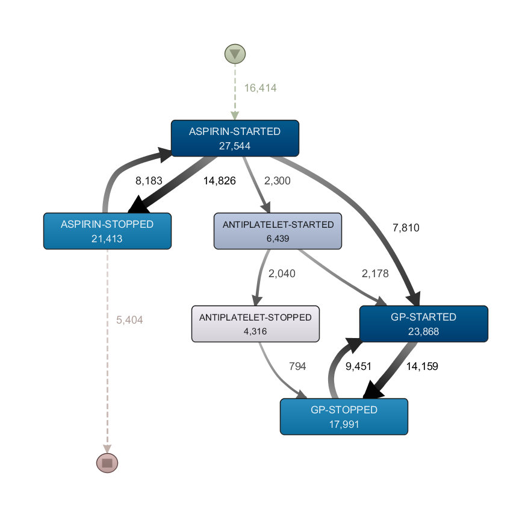
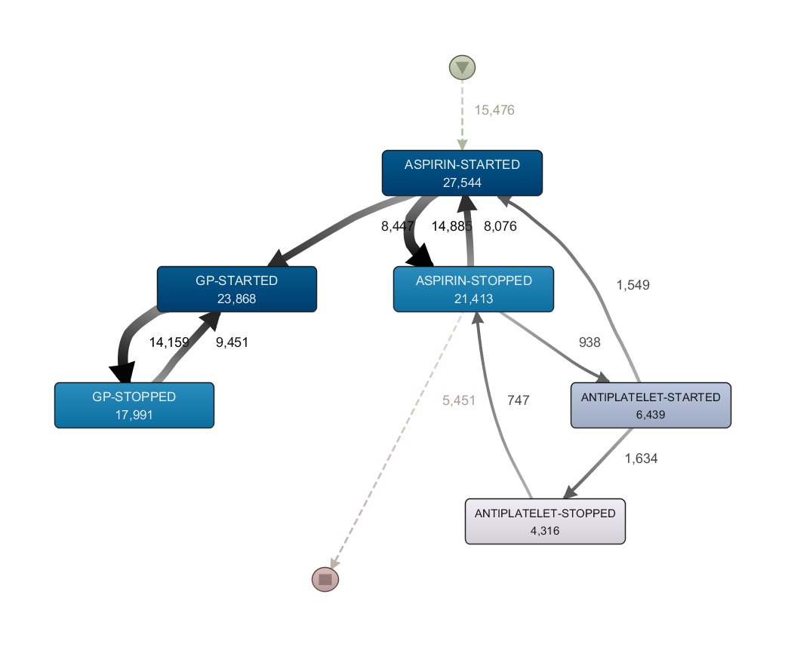
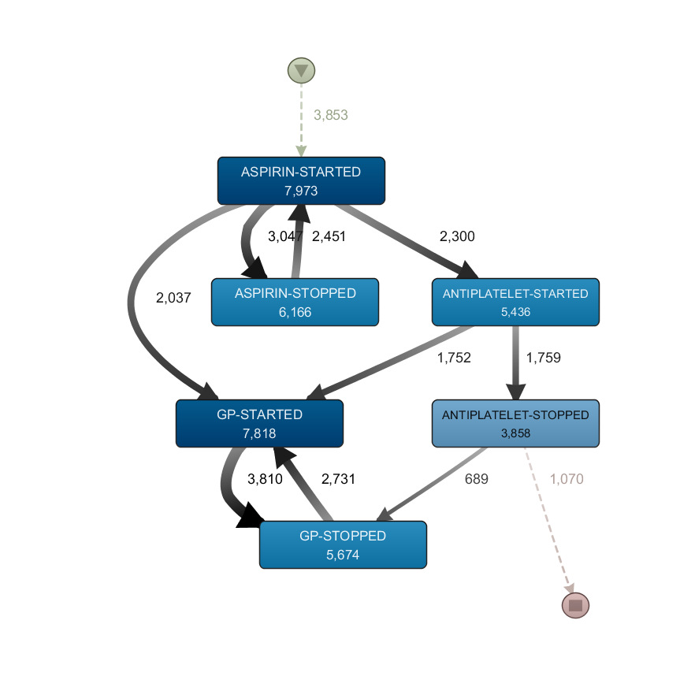
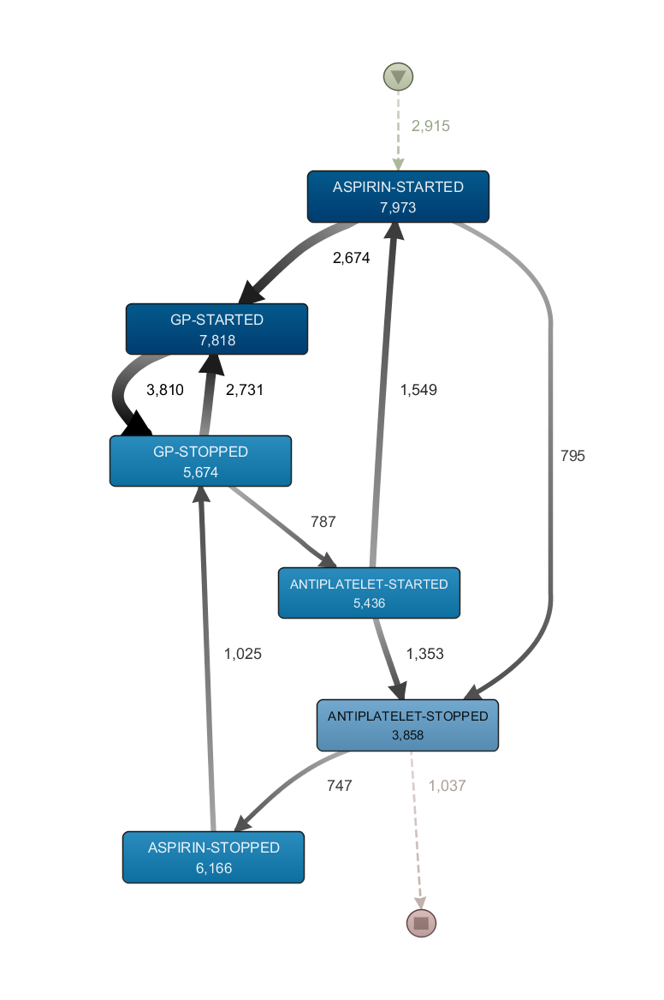
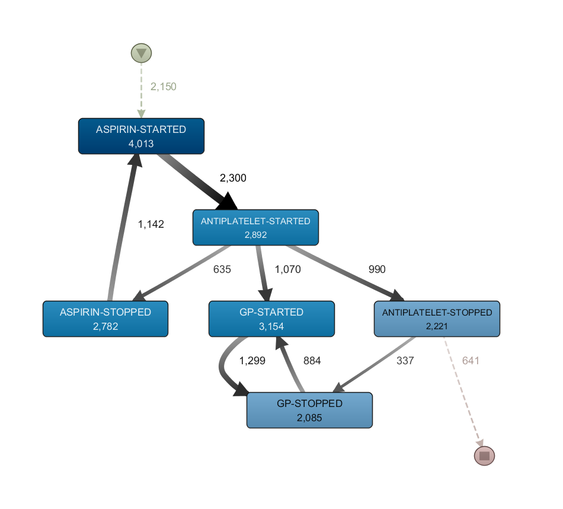
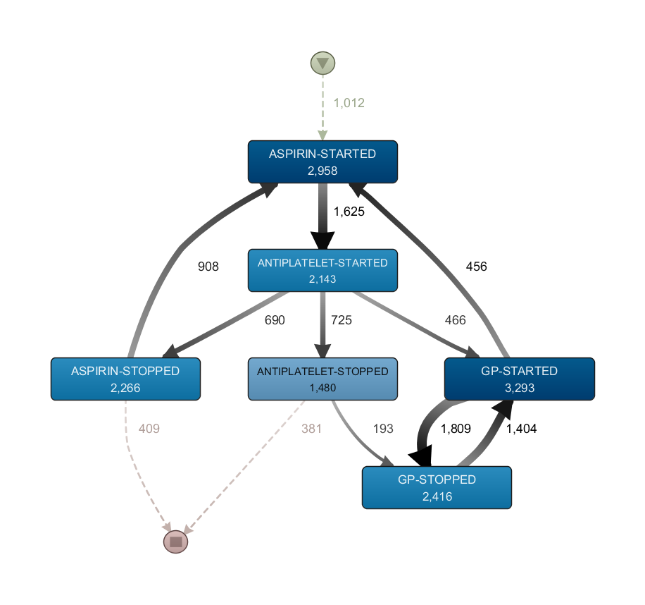

# Process mining notes

## 1 Aspirin + Antiplatelet must have Gastro Protection medication

### 1.1 Overview

One of the indicators in our SMASH dashboard looks for patients who are currently prescribed aspirin and at least one other antiplatelet, but who are not currently prescribed a gasto-protective (GP) medication. I picked this indicator because it has more events (3 start and 3 stop for each drug) than some of the other indicators. It also has multiple options - the pharmacist or GP can chose to stop an existing medication or start a new one.

### 1.2 Method

- I extracted all prescriptions for aspirin, other antiplatelets (clopidogrel, ticagrelor, prasugrel), and gastro protective medication (H2 antagonists and proton pump inhibitors).
- Collapsed the prescriptions into STARTED and STOPPED events based on dose, instruction and packet size (e.g. if given 30 pills and the instruction of "take 2 daily" then we assume the drug is stopped 15 days after initiation unless a subsequent prescription is found in the record.) This uses methodology from my previous publication on this^1^.
- Load data into Disco
- Filtered to just those paths that start with "ASPIRIN-STARTED" or "ANTIPLATELET-STARTED" on the basis that patients who initiated a GP drug for a different reason aren't really following the same process
- We only have dates - the time always defaults to 4am. So to avoid concurrent events I have added 1 hour to every gasto-protection prescription as it makes sense to prescribe this after the antiplatelets. I then analysed the data twice: in *analysis A* I subtracted 1 hour from all aspirin prescriptions, and in *analysis B* I substracted 1 hour from all antiplatelet prescriptions.

### 1.3 Output

#### 1.3.1 Initial output process maps

<figure class="two-column">
<figcaption>Figure 1. Analysis A (aspirin before antiplatelet when concurrent)</figcaption>

</figure>

<figure class="two-column">
<figcaption>Figure 2. Analysis B (antiplatelet before aspirin when concurrent)</figcaption>

</figure>

#### 1.3.2 Filter to pathways with both an "ASPIRIN-STARTED" event and an "ANTIPLATELET-STARTED" event

The following figures are just those cases that have both aspirin and another antiplatelet prescribed at any time as this more closely reflects the patients who appear in the dashboard.

<figure class="two-column">
<figcaption>Figure 3. Analysis A (aspirin before antiplatelet when concurrent)</figcaption>

</figure>

<figure class="two-column">
<figcaption>Figure 4. Analysis B (antiplatelet before aspirin when concurrent)</figcaption>

</figure>

#### 1.3.3 Filter to pathways with an "ASPIRIN-STARTED" event immediately before an "ANTIPLATELET-STARTED" event

<figure class="two-column">
<figcaption>Figure 5. Analysis A (aspirin before antiplatelet when concurrent)</figcaption>

</figure>

<figure class="two-column">
<figcaption>Figure 6. Analysis B (antiplatelet before aspirin when concurrent)</figcaption>

</figure>

### 1.4 Thoughts and questions

- Timeshift: I think I can justify why I shift GP meds back in time, but I'm less sure as to whether aspirin or antiplatelets should be prescribed first. I'm thinking of doing something akin to a sensitivity analysis whereby I repeat the analysis under different assumptions. ***Is this something that others have done with process mining - or if not does it sound a reasonable approach?***
- Figure 1 
	- Lots of people are starting a GP after aspirin. These people probably have some other reason why they need gasto-protection e.g. they're also on Warfarin or have a history of internal bleeds / ulcers. In fact our medication dashboard has all of the following groups of patients who should have a GP:
		- Age >65 + NSAID
		- Aspirin + Antiplatelet
		- History of bleeds + Antiplatelet (including aspirin) 
		- History of bleeds + NSAID
		- Warfarin + Antiplatelet (including aspirin)
	- ***Perhaps I should look at a combined pathway including NSAID, antiplatelets, aspirin, warfarin and bleed history which might help find the interactions in patients with multiple morbidities?***
- Manual editing of process map: These process maps have routes that don't terminate e.g. you get stuck in a loop and can't get to the "STOP" node. I guess this is ok and is just trying to prevent spaghetti, but ***is it possible within Disco (or a different tool) to say something like "only show the top 60% of paths but always include all paths from the START node and all paths to the END node"?*** Maybe for maps with not many nodes like this I should just include all paths.
- Minor annoyances:
	- Is there a way to save a project (currently I try to open a new one then save when it warns I have unsaved changes but there must be a better way)
		
### 2 References

1. Williams R, Brown B, Peek N, Buchan I., “Making Medication Data Meaningful: Illustrated with Hypertension,” Stud. Health Technol. Inform., vol. 228, pp. 247–51, 2016.